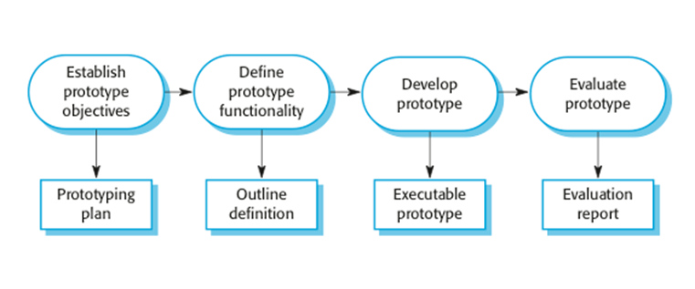

# SoftwareConstruction

**What is a software process model?**

A software process model is an abstraction of the software development processModels, by their nature, are a simplification. The models specify the stages and order of a process. 
A model will define the following:

The tasks to be performed

The input and output of each task

The pre and post conditions for each task

The flow and sequence of each task

**SDLC MODELS**

**Waterfall  Model**

The waterfall model is a sequential approach, where each fundamental activity of a process is represented as a separate phase, arranged in linear order. In the waterfall model, you must plan and schedule all of the activities before starting working on them (plan-driven process).
Plan driven process is a process where activities are planned first, and the progress is measured against the plan.
In principle, the result of each phase is one or more documents that should be approved and the next phase shouldn’t be started until the previous phase has completely been finished.
 

**ADVANTAGES**

Simple to use and understand

Management simplicity thanks to its rigidity: every phase has a defined result and process review

Development stages go one by one

Perfect for the small or mid-sized projects where requirements are clear and not equivocal

Easy to determine the key points in the development cycle

**DISADVANTAGES**

The software is ready only after the last stage is over

Only best for circumstances when requirements are well understood and unlikely to change radically during development as this model has a relatively rigid structure which makes it relatively hard to accommodate change when the process is underway.

High risks and uncertainty

Not the best choice for complex and object-oriented projects

Inappropriate for the long-term projects

The progress of the stage is hard to measure while it is still in the development

Integration is done at the very end, which does not give the option of identifying the problem in advance

**Prototyping**

A prototype is a version of a system or part of the system that’s developed quickly to check the customer’s requirements or feasibility of some design decisions.
So, a prototype is useful when a customer or developer is not sure of the requirements, or of algorithms, efficiency, business rules, response time, etc.
In prototyping, the client is involved throughout the development process, which increases the likelihood of client acceptance of the final implementation.
While some prototypes are developed with the expectation that they will be discarded, it is possible in some cases to evolve from prototype to working system.

**Advantages**

This model is flexible in design.

It is easy to detect errors.

We can find missing functionality easily.

There is scope of refinement, it means new requirements can be easily accommodated.

It can be reused by the developer for more complicated projects in the future.

**DISADVANTAGES**

This model is costly.

It has poor documentation because of continuously changing customer requirements.

There may be too much variation in requirements.

Customers sometimes demand the actual product to be delivered soon after seeing an early prototype.
 
There may be sub-optimal solutions because of developers in a hurry to build prototypes.
 
Customers may not be satisfied or interested in the product after seeing the initial prototype.

**Spiral  Model**
The spiral model is risk-driven where the process is represented as a spiral rather than a sequence of activities.
It was designed to include the best features from the waterfall and prototyping models, and introduces a new component; risk assessment.
Each loop (from review till service — see figure below) in the spiral represents a phase. Thus the first loop might be concerned with system feasibility, the next loop might be concerned with the requirements definition, the next loop with system design, and so on.

 

**ADVANTAGES**
Lifecycle is divided into small parts, and if the risk concentration is higher, the phase can be finished earlier to address the treats

The development process is precisely documented yet scalable to the changes

The scalability allows to make changes and add new functionality even at the relatively late stages

**DISADVANTAGES**
Can be quite expensive

The risk control demands involvement of the highly-skilled professionals

Can be ineffective for the small projects

Big number of the intermediate stages requires excessive documentation

**Incremental Model**

Incremental development is based on the idea of developing an initial implementation, exposing this to user feedback, and evolving it through several versions until an acceptable system has been developed.
The activities of a process are not separated but interleaved with feedback involved across those activities.

 
Each system increment reflects a piece of the functionality that is needed by the customer. Generally, the early increments of the system should include the most important or most urgently required functionality.
This means that the customer can evaluate the system at early stage in the development to see if it delivers what’s required. If not, then only the current increment has to be changed and, possibly, new functionality defined for later increments.
 
**Iterative Model**
The iterative development model aims to develop a system by building small portions of all the features, across all components.
We build a product that meets the initial scope and releases it quickly for customer feedback. An early version with limited features is important to establish a market and get customer feedback.
In each increment, a slice of system features is delivered, passing through the requirements till the deployment.

The phases of iterative development are:
Inception: The goal is to establish a business case for the system. We should identify all the external entities that will interact with the system, and define these interactions. Then, uses this information to assess the contribution that the system makes to the business. If the contribution is minor, then the project may be canceled.
Elaboration: We develop an understanding of the problem domain and architecture framework, develop the project plan, and identify risks.
Construction: Incrementally fills in the architecture with production-ready code produced from analysis, design, implementation, and testing of the requirements. The components of the system are dependent on each other and they’re developed in parallel and integrated during this phase. On the completion of this phase, you should have a complete working software.
Transition: We deliver the system into the production operating environment.

**Advantages**
 
Some working functionality can be developed and early in the software development life cycle (SDLC).

It is easily adaptable to the ever changing needs of the project as well as the client.

It is best suited for agile organisations.

It is more cost effective to change the scope or requirements in Iterative model.

Parallel development can be planned.

**Disadvantages**
More resources may be required.

Although cost of change is lesser, but it is not very suitable for changing requirements.

More management attention is required.

It is not suitable for smaller projects.

Highly skilled resources are required for skill analysis.

Project progress is highly dependent upon the risk analysis phase.

Defining increments may require definition of the complete system.
 
 
**Agile Model**
Agility is flexibility, it is a state of dynamic, adapted to the specific circumstances.
The agile method refers to a group of software development models based on the incremental and iterative approach, in which the increments are small and typically, new releases of the system are created and made available to customers every few weeks.

They involve customers in the development process to propose requirements changes. They minimize documentation by using informal communications rather than formal meetings with written documents.
They are best suited for applications where the requirements change rapidly during the development process.
There are a number of different agile methods available such as: Scrum, Crystal, Agile Modeling (AM), Extreme Programming (XP), etc.
 
 **Advantages**
 
In Agile methodology the delivery of software is unremitting.

The customers are satisfied because after every Sprint working feature of the software is delivered to them.

Customers can have a look of the working feature which fulfilled their expectations.

If the customers has any feedback or any change in the feature then it can be accommodated in the current release of the product.

In Agile methodology the daily interactions are required between the business people and the developers.

In this methodology attention is paid to the good design of the product.

**Disadvantages** 
In Agile methodology the documentation is less.

Sometimes in Agile methodology the requirement is not very clear hence it’s difficult to predict the expected result.

In few of the projects at the starting of the software development life cycle it’s difficult to estimate the actual effort required.

Because of the ever-evolving features, there is always a risk of the ever-lasting project.

For complex projects, the resource requirement and effort are difficult to estimate.
 
 
 

